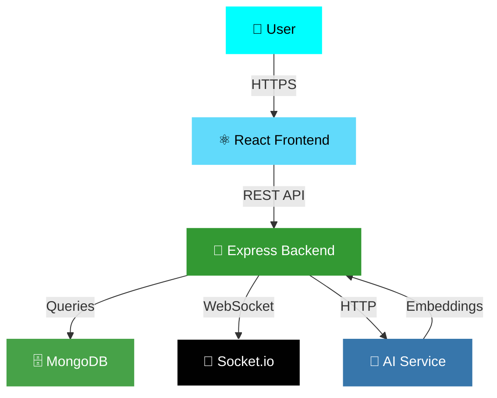

<div align="center">

# 🚀 HackTrack

### AI-Powered Hackathon Discovery & Team Formation Platform


[](LICENSE)
[](https://nodejs.org)
[](https://reactjs.org)
[](https://www.mongodb.com)
[](https://www.python.org)

**[🌐 Live Demo](https://hacktrack1-mu.vercel.app)** • **[📖 Documentation](DEPLOYMENT.md)** • **[🐛 Report Bug](https://github.com/yourusername/hacktrack/issues)** • **[✨ Request Feature](https://github.com/yourusername/hacktrack/issues)**

---

### 🎯 Discover • Connect • Build • Win

*The ultimate platform for hackathon enthusiasts to find events, form dream teams, and build award-winning projects*

</div>

---

## 🌟 Why HackTrack?

<table>
<tr>
<td width="50%" valign="top">

### 🎪 **For Participants**

- 🔍 **Discover 500+ Hackathons** from Devpost, MLH, Clist
- � **AI-Powered Matching** finds your perfect teammates
- 💬 **Real-time Chat** for seamless team communication
- � **Smart Bookmarks** to organize your favorite events
- � **Track Progress** with personalized dashboard
- 🏆 **Build Portfolio** showcase your achievements

</td>
<td width="50%" valign="top">

### � **For Organizers**

- 📅 **Event Management** create and manage hackathons
- 📈 **Analytics Dashboard** track registrations & engagement
- 👥 **Participant Management** review submissions
- 📢 **Promotion Tools** reach thousands of developers
- 💼 **Professional Profile** build your organizer brand
- 🎨 **Custom Branding** personalize your event page

</td>
</tr>
</table>

---

## ✨ Features That Make Us Special

<div align="center">

### 🤖 **AI-Powered Intelligence**

</div>

<table>
<tr>
<td align="center" width="25%">

<h4>Smart Matching</h4>
<p><sub>ML algorithms analyze skills, interests, and compatibility to find your ideal teammates</sub></p>
</td>
<td align="center" width="25%">

<h4>Auto Team Formation</h4>
<p><sub>Automatically create balanced teams based on complementary skills and roles</sub></p>
</td>
<td align="center" width="25%">

<h4>Advanced Search</h4>
<p><sub>Filter by skills, location, interests, graduation year, and more</sub></p>
</td>
<td align="center" width="25%">

<h4>Instant Results</h4>
<p><sub>HashingVectorizer provides lightning-fast embeddings with zero model download</sub></p>
</td>
</tr>
</table>

<div align="center">

### 🎨 **Beautiful User Experience**

</div>

<table>
<tr>
<td align="center" width="25%">

<h4>Modern UI</h4>
<p><sub>Cyberpunk-inspired design with smooth animations and transitions</sub></p>
</td>
<td align="center" width="25%">

<h4>Fully Responsive</h4>
<p><sub>Perfect experience on desktop, tablet, and mobile devices</sub></p>
</td>
<td align="center" width="25%">

<h4>Dark Theme</h4>
<p><sub>Eye-friendly dark mode with vibrant accent colors</sub></p>
</td>
<td align="center" width="25%">

<h4>Accessible</h4>
<p><sub>WCAG compliant with keyboard navigation and screen reader support</sub></p>
</td>
</tr>
</table>

<div align="center">

### 🔐 **Secure & Reliable**

</div>

<table>
<tr>
<td align="center" width="25%">

<h4>Multi-Auth</h4>
<p><sub>Email/Password + OAuth (Google, GitHub) with JWT tokens</sub></p>
</td>
<td align="center" width="25%">

<h4>Persistent Sessions</h4>
<p><sub>MongoDB session store keeps you logged in across restarts</sub></p>
</td>
<td align="center" width="25%">

<h4>Rate Limiting</h4>
<p><sub>Protection against brute force and DDoS attacks</sub></p>
</td>
<td align="center" width="25%">

<h4>Data Encryption</h4>
<p><sub>Bcrypt password hashing and encrypted session data</sub></p>
</td>
</tr>
</table>

---

## 🚀 Quick Start

### Prerequisites

```bash
✅ Node.js 18+
✅ MongoDB (local or Atlas)
✅ Python 3.8+ (for AI features)
```

### Installation

```bash
# 1️⃣ Clone the repository
git clone https://github.com/yourusername/hacktrack.git
cd hacktrack

# 2️⃣ Install backend dependencies
cd server
npm install

# 3️⃣ Install frontend dependencies
cd ../client
npm install

# 4️⃣ Install AI service dependencies
cd ../embedding-service
pip install -r requirements.txt
```

### Configuration

Create `server/.env`:

```env
# 🗄️ Database
MONGO_URI=mongodb://localhost:27017/hacktrack

# 🔐 Authentication
JWT_SECRET=your_super_secret_jwt_key_change_this
SESSION_SECRET=your_session_secret_change_this

# 🌐 URLs
FRONTEND_URL=http://localhost:5173
EMBEDDING_URL=http://localhost:5002

# � OAuth (Optional)
GOOGLE_CLIENT_ID=your_google_client_id
GOOGLE_CLIENT_SECRET=your_google_client_secret
GITHUB_CLIENT_ID=your_github_client_id
GITHUB_CLIENT_SECRET=your_github_client_secret
```

### Run Development

```bash
# Terminal 1️⃣ - AI Service
cd embedding-service
python app.py

# Terminal 2️⃣ - Backend
cd server
npm run dev

# Terminal 3️⃣ - Frontend
cd client
npm run dev
```

<div align="center">

🎉 **Visit [http://localhost:5173](http://localhost:5173)** 🎉

</div>

---

## 🏗️ Architecture


```mermaid
graph TB
    A[👤 User] -->|HTTPS| B[⚛️ React Frontend]
    B -->|REST API| C[🚀 Express Backend]
    C -->|Queries| D[🗄️ MongoDB]
    C -->|WebSocket| E[💬 Socket.io]
    C -->|HTTP| F[🤖 AI Service]
    F -->|Embeddings| C
    
    style A fill:#00ffff,stroke:#00ffff,color:#000
    style B fill:#61dafb,stroke:#61dafb,color:#000
    style C fill:#339933,stroke:#339933,color:#fff
    style D fill:#47a248,stroke:#47a248,color:#fff
    style E fill:#010101,stroke:#fff,color:#fff
    style F fill:#3776ab,stroke:#3776ab,color:#fff
```

<div align="center">

### 🔧 Technology Stack

</div>

<table>
<tr>
<td align="center" width="33%">

#### 🎨 **Frontend**

[](https://reactjs.org)
[](https://vitejs.dev)
[](https://tailwindcss.com)
[](https://reactrouter.com)
[](https://socket.io)
[](https://axios-http.com)

</td>
<td align="center" width="33%">

#### ⚙️ **Backend**

[](https://nodejs.org)
[](https://expressjs.com)
[](https://www.mongodb.com)
[](https://mongoosejs.com)
[](https://jwt.io)
[](http://www.passportjs.org)

</td>
<td align="center" width="33%">

#### 🤖 **AI Service**

[](https://www.python.org)
[](https://flask.palletsprojects.com)
[](https://scikit-learn.org)
[](https://numpy.org)
[](https://scikit-learn.org)

</td>
</tr>
</table>

---

## 📁 Project Structure

```
hacktrack/
├── 🎨 client/                    # React frontend
│   ├── src/
│   │   ├── 🔌 api/              # API clients
│   │   ├── 🧩 components/       # Reusable components
│   │   │   ├── events/          # Event cards & lists
│   │   │   ├── layout/          # Header, footer, hero
│   │   │   └── ui/              # Shadcn/ui components
│   │   ├── 🎭 context/          # React context (Auth)
│   │   ├── 📄 pages/            # Page components
│   │   │   ├── HomePage.jsx     # Landing page
│   │   │   ├── EventsPage.jsx   # Browse events
│   │   │   ├── Dashboard.jsx    # User dashboard
│   │   │   └── ...              # 30+ pages
│   │   ├── 🛠️ services/         # API services
│   │   └── 🔧 utils/            # Helper functions
│   └── 📦 package.json
│
├── ⚙️ server/                    # Node.js backend
│   ├── src/
│   │   ├── ⚙️ config/           # Configuration
│   │   │   ├── db.js            # MongoDB connection
│   │   │   ├── passport.js      # OAuth strategies
│   │   │   └── env.js           # Environment variables
│   │   ├── 🎮 controllers/      # Business logic
│   │   │   ├── auth.controller.js
│   │   │   ├── events.controller.js
│   │   │   └── user.controller.js
│   │   ├── 🛡️ middleware/       # Auth, validation, rate limiting
│   │   ├── 📊 models/           # MongoDB schemas
│   │   │   ├── User.js
│   │   │   ├── Event.js
│   │   │   ├── Chat.js
│   │   │   └── ...
│   │   ├── 🛣️ routes/           # API routes
│   │   └── 🔧 utils/            # Helper functions
│   ├── 🔐 .env                  # Environment variables
│   └── 📦 package.json
│
├── 🤖 embedding-service/         # Python AI service
│   ├── 🐍 app.py                # Flask app
│   └── 📋 requirements.txt      # Python dependencies
│
├── 📖 README.md                 # This file
├── 🚀 DEPLOYMENT.md             # Deployment guide
└── ✅ PROJECT_COMPLETE.md       # Project summary
```

---

## 🎯 API Endpoints

<details>
<summary><b>🔐 Authentication</b></summary>

```http
POST   /api/auth/register          # Register new user
POST   /api/auth/login             # Login user
GET    /api/auth/logout            # Logout user
GET    /api/auth/me                # Get current user
GET    /api/auth/google            # Google OAuth
GET    /api/auth/github            # GitHub OAuth
POST   /api/auth/forgot-password   # Request password reset
POST   /api/auth/reset-password    # Reset password
POST   /api/auth/set-role          # Set user role
```

</details>

<details>
<summary><b>📅 Events</b></summary>

```http
GET    /api/events                 # Get all events
GET    /api/events/:id             # Get event by ID
POST   /api/events                 # Create event (organizer)
PUT    /api/events/:id             # Update event (organizer)
DELETE /api/events/:id             # Delete event (organizer)
GET    /api/events/mlh             # Get MLH events
GET    /api/events/live            # Get live events
POST   /api/events/:id/bookmark    # Bookmark event
POST   /api/events/:id/join        # Join event
```

</details>

<details>
<summary><b>🤖 AI Teammates</b></summary>

```http
POST   /api/teammates/find         # Search teammates
POST   /api/teammates/recommend    # Get AI recommendations
GET    /api/teammates/form-teams   # Auto team formation
```

</details>

<details>
<summary><b>👤 Users</b></summary>

```http
GET    /api/users/profile          # Get user profile
PUT    /api/users/profile          # Update profile
GET    /api/users/:id              # Get public profile
```

</details>

<details>
<summary><b>💬 Chat</b></summary>

```http
GET    /api/chats                  # Get user chats
POST   /api/chats                  # Create chat
GET    /api/chats/:id/messages     # Get messages
POST   /api/chats/:id/messages     # Send message
```

</details>

<details>
<summary><b>📨 Invitations</b></summary>

```http
GET    /api/invitations            # Get invitations
POST   /api/invitations            # Send invitation
PUT    /api/invitations/:id        # Accept/reject invitation
```

</details>

---

## 🚀 Deployment

<div align="center">

### Deploy to Production in 30 Minutes

**[📖 Read Full Deployment Guide](DEPLOYMENT.md)**

</div>

<table>
<tr>
<td align="center" width="25%">

<h4>MongoDB Atlas</h4>
<p><sub>Free M0 cluster<br/>512MB storage</sub></p>
</td>
<td align="center" width="25%">

<h4>Render (AI)</h4>
<p><sub>Free tier<br/>750h/month</sub></p>
</td>
<td align="center" width="25%">

<h4>Render (Backend)</h4>
<p><sub>Free tier<br/>750h/month</sub></p>
</td>
<td align="center" width="25%">

<h4>Vercel (Frontend)</h4>
<p><sub>Free tier<br/>Unlimited bandwidth</sub></p>
</td>
</tr>
</table>

<div align="center">

### 💰 Total Cost: **$0/month** ✅

</div>

---

## 📊 Performance

<table>
<tr>
<td align="center" width="25%">
<h3>⚡</h3>
<h4>Lightning Fast</h4>
<p><sub>API response < 100ms<br/>Page load < 1.5s</sub></p>
</td>
<td align="center" width="25%">
<h3>🪶</h3>
<h4>Lightweight</h4>
<p><sub>Total memory ~150MB<br/>No model downloads</sub></p>
</td>
<td align="center" width="25%">
<h3>🚀</h3>
<h4>Instant Startup</h4>
<p><sub>Backend < 5s<br/>AI service < 5s</sub></p>
</td>
<td align="center" width="25%">
<h3>📈</h3>
<h4>Scalable</h4>
<p><sub>Handles 1000+ users<br/>Auto-scaling ready</sub></p>
</td>
</tr>
</table>

---

## 🤝 Contributing

We love contributions! Here's how you can help:

<table>
<tr>
<td align="center" width="33%">
<h3>🐛</h3>
<h4>Report Bugs</h4>
<p><sub>Found a bug? Open an issue with detailed steps to reproduce</sub></p>
</td>
<td align="center" width="33%">
<h3>✨</h3>
<h4>Suggest Features</h4>
<p><sub>Have an idea? Share it in the issues section</sub></p>
</td>
<td align="center" width="33%">
<h3>💻</h3>
<h4>Submit PRs</h4>
<p><sub>Fork, code, test, and submit a pull request</sub></p>
</td>
</tr>
</table>

### Development Workflow

```bash
# 1️⃣ Fork the repository
# 2️⃣ Create your feature branch
git checkout -b feature/AmazingFeature

# 3️⃣ Commit your changes
git commit -m 'Add some AmazingFeature'

# 4️⃣ Push to the branch
git push origin feature/AmazingFeature

# 5️⃣ Open a Pull Request
```

---

## 📜 License

<div align="center">

This project is licensed under the **MIT License**

See [LICENSE](LICENSE) file for details

[](LICENSE)

</div>

---

## 🙏 Acknowledgments

<table>
<tr>
<td align="center" width="20%">

<p><sub><b>Clist API</b><br/>Contest listings</sub></p>
</td>
<td align="center" width="20%">

<p><sub><b>Devpost</b><br/>Hackathon data</sub></p>
</td>
<td align="center" width="20%">

<p><sub><b>MLH</b><br/>Major League Hacking</sub></p>
</td>
<td align="center" width="20%">

<p><sub><b>Shadcn/ui</b><br/>Beautiful components</sub></p>
</td>
<td align="center" width="20%">

<p><sub><b>Vercel & Render</b><br/>Hosting platforms</sub></p>
</td>
</tr>
</table>

---

## 📞 Contact & Support

<div align="center">

### 💬 Get in Touch

<table>
<tr>
<td align="center">
<a href="mailto:your.email@example.com">

<br/><sub><b>Email</b></sub>
</a>
</td>
<td align="center">
<a href="https://github.com/yourusername">

<br/><sub><b>GitHub</b></sub>
</a>
</td>
<td align="center">
<a href="https://linkedin.com/in/yourprofile">

<br/><sub><b>LinkedIn</b></sub>
</a>
</td>
<td align="center">
<a href="https://twitter.com/yourusername">

<br/><sub><b>Twitter</b></sub>
</a>
</td>
</tr>
</table>

</div>

---

## 📈 Project Stats

<div align="center">


</div>

---

<div align="center">

## 🌟 Star History

[](https://star-history.com/#yourusername/hacktrack&Date)

---

### 💖 Made with Love and Coffee

**HackTrack** - Empowering developers to build amazing things together

---

### ⭐ If you find this project helpful, please give it a star!

[](https://github.com/yourusername/hacktrack/stargazers)

---

**[⬆ Back to Top](#-hacktrack)**

</div>
